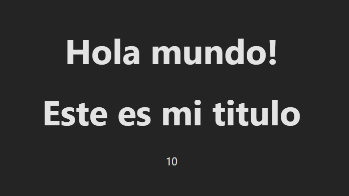

📖 Desafío 02: Componente FirstApp
Crear el componente FirstApp.jsx en el proyecto de Vite que retorna un título dentro de la etiqueta `<h1>` y el texto "10" dentro de una etiqueta ``, implementando props, propTypes y defaultProps.

